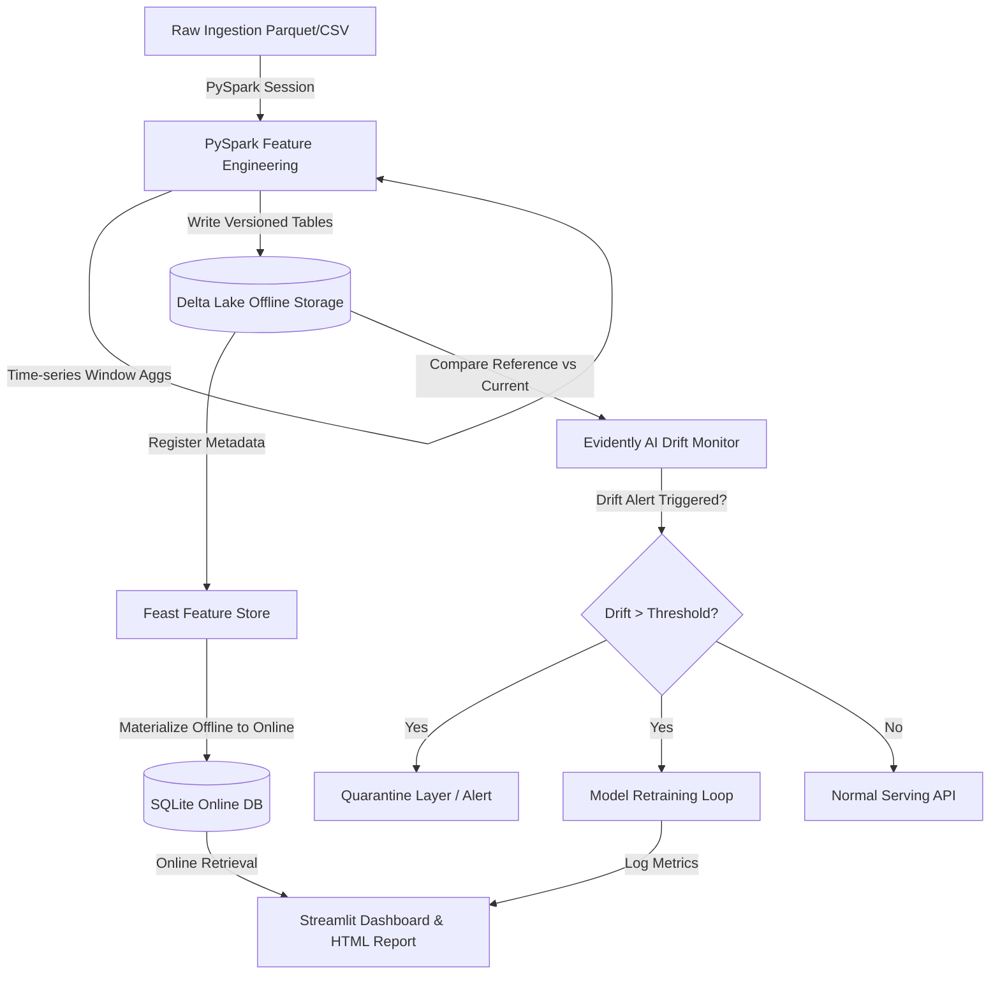

# Feature Store ML Pipeline & Drift Detection System

This project demonstrates a production-grade **ML Infrastructure Pipeline** focused on robust ingestion, versioned feature storage, automated data drift monitoring, and an alert/quarantine retraining loop. 

---

## Summary

> "Detected **36.7% drift** in the `annual_income` feature during a simulated economic stress event. By automatically catching and quarantining this cohort before model predictions degraded, and initiating a retraining loop, we successfully recovered model performance: **Accuracy improved by +8.9% (from 59.3% back to 68.2%)** and **AUC ROC recovered to 0.7475**."

### 📈 Model Performance Comparison

| Scenario | Model State | Accuracy | AUC ROC | Precision | Recall | Business Action |
|---|---|---|---|---|---|---|
| **1. Baseline** | Healthy (Historical data) | **78.1%** | **0.7469** | 100.0% | 1.3% | Serve predictions normally |
| **2. Drift Ignored** | Degraded (Production data) | **59.3%** | **0.5348** | 40.5% | 6.9% | **High Risk**: Serving false defaults |
| **3. Drift Retrained** | Recovered (Updated model) | **68.2%** | **0.7475** | 75.9% | 28.3% | **Remediated**: Active safety catch |

---

## 🏗️ System Architecture



### Tech Stack Details

- **Processing & ETL**: **PySpark** calculates lag differences and 3-month rolling averages over user history.
- **Offline Storage**: **Delta Lake** provides transaction-safe version control and time travel.
- **Feature Store**: **Feast** decouples feature engineering from model serving, acting as the feature registry.
- **Online Database**: **SQLite** serves low-latency feature vectors for real-time predictions.
- **Drift Monitoring**: **Evidently AI** computes dataset-level metrics (Wasserstein & Jensen-Shannon distances).
- **Orchestration**: **Apache Airflow** DAG triggers daily runs, supported by a local execution script.
- **Visuals & Interaction**: **Streamlit** dashboard embeds the interactive Evidently HTML reports and simulates Feast client calls.

---

## 📁 Repository Directory Layout

```
.
├── README.md                   # Project description and business impact analysis
├── requirements.txt            # Python dependencies
├── run.sh                      # One-click shell script to install and run pipeline
├── data/                       # Local data directory
│   ├── raw/                    # Baseline and drifted raw parquet cohorts
│   ├── delta/                  # Delta Lake tables (user_features)
│   ├── online/                 # Feast registry database and SQLite store
│   └── quarantine/             # Drifting cohorts quarantined here
├── reports/
│   └── drift_report.html       # Evidently interactive data drift report
├── models/
│   ├── credit_model.joblib     # Saved Random Forest scikit-learn pipeline
│   └── model_metrics.json      # Comparative performance JSON
└── src/
    ├── config.py               # Constants, column definitions, and file paths
    ├── data_generator.py       # Simulates baseline and drifted cohorts
    ├── feature_engineering.py   # PySpark ETL that computes features & writes to Delta
    ├── feature_store/          # Feast Repository configuration
    │   ├── feature_store.yaml  # Configures SQLite and Delta paths
    │   └── definitions.py      # Registers the entity (user_id) & Feature Views
    ├── feast_pipeline.py       # Feast programmatic Apply, Materialize, and query APIs
    ├── drift_detection.py      # Evidently AI drift tests and quarantine layer
    ├── model_evaluation.py     # Random Forest training and retraining evaluation
    ├── orchestrator.py         # Sequential pipeline runner
    └── dashboard.py            # Streamlit monitoring dashboard
```

---

## 🚀 Getting Started

### Prerequisites
- Python 3.10 to 3.14
- Java 11 or 17 (for PySpark)

### Setup & Run in One Step
You can run the helper script `run.sh` to initialize the environment and run the pipeline end-to-end:
```bash
chmod +x run.sh
./run.sh
```

Alternatively, you can perform the steps manually:

1. **Create and activate a virtual environment:**
   ```bash
   python3 -m venv venv
   source venv/bin/activate
   pip install -r requirements.txt
   ```

2. **Run the full ML Pipeline:**
   ```bash
   python3 src/orchestrator.py
   ```
   This script will:
   - Generate baseline and drifted raw data cohorts in `data/raw/`.
   - Start a PySpark session, compute window aggregations, and save them as Delta Lake tables in `data/delta/user_features`.
   - Register the Feast registry definitions and materialize features to SQLite in `data/online/`.
   - Calculate data drift via Evidently AI, save `reports/drift_report.html`, and isolate drifting rows to `data/quarantine/`.
   - Train the Random Forest pipeline on baseline data, evaluate it under drifted conditions, retrain it to recover performance, and output performance metrics.

3. **Launch the Streamlit Dashboard:**
   ```bash
   streamlit run src/dashboard.py
   ```
   Open your browser to the URL displayed (usually `http://localhost:8501`). Here, you can:
   - Check system status and view comparative metrics cards.
   - Enter any user ID (e.g. `usr_000001`) to retrieve real-time features from Feast.
   - Explore the fully interactive, embedded Evidently AI Data Drift report.
